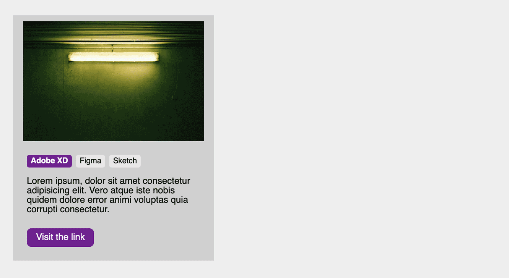
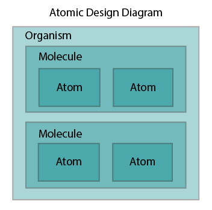
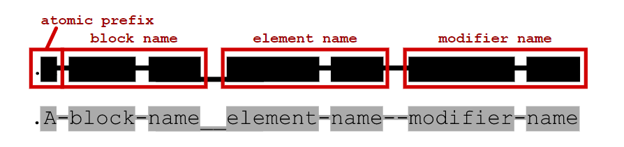
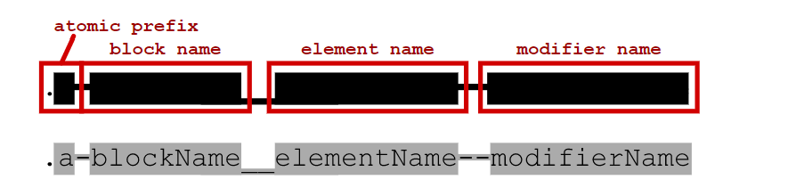

<!-- omit in toc -->
# Méthodologie de nommage

Il existe bon nombres de méthodologie de nommage, elles existent pour simplifier la tâche des développeurs et leurs permettent de s'y retrouver dans le nom de leurs classes. Cela rend également plus facile la collaboration dans une équipe, car tout le monde s'applique à respecter la méthode choisie et ainsi tout est plus claire pour l'ensemble des personnes travaillant sur le code.

Nous allons voir "2 méthodes" connues qui sont BEM et ABEM. Alors c'est partit!
<!-- omit in toc -->
# Table des matières
- [BEM (Block Element Modifier) : B__E — M](#bem-block-element-modifier--b__e--m)
  - [Comment qu'on écrit avec BEM](#comment-quon-écrit-avec-bem)
  - [Convention de nommage BEM](#convention-de-nommage-bem)
  - [Avantages et Inconvénients](#avantages-et-inconvénients)
- [ABEM (Atomic Block Element Modifier) : A-B__E -M](#abem-atomic-block-element-modifier--a-b__e--m)
  - [Convention de nommage ABEM](#convention-de-nommage-abem)
    - [Gestion de la case](#gestion-de-la-case)
    - [Atomic Design](#atomic-design)
    - [Gestion des modifiers](#gestion-des-modifiers)
- [Conclusion](#conclusion)
- [Crédits](#crédits)

## BEM (Block Element Modifier) : B__E — M

Bem ou Block Element Modifier est une méthodologie de nommage qui vise à créer des composants réutilisables pour vos classes HTML et vos sélecteurs CSS. L'intérêt réside dans la possibilité de sélectionner un élément bien précis sans devoir toujours utiliser la descendance (ex: sélectionner les enfants du parents), car sur certains projets plus volumineux vous risquez de sélectionner des parties d'une autre page que vous auriez oublié et du coup casser le projet. 

L'autre point fort, c'est que quand vous aurez adopter cette méthodologie, vous écrirez vos classes beaucoup plus rapidement et éfficacement et aurez l'habitude de les préparer pour leurs utilisations globale plutôt que par cas. Je m'explique. 

* Vous voulez créer un bouton sur votre page. Vous allez créer une classe `button`
* Sur une deuxième page vous avez encore un bouton mais ce dernier doit être mis en valeur, vous allez créer une classe `active`.
* Plus tard vous voulez mettre une div en évidence aussi de la même façon que votre bouton. Mais la classe `active`est déjà prise. Du coup vous allez peut-être la nommer `active2` ou `active-div`. Alors oui, jusque là on s'y retrouve mais sur un gros projet ça peut vite devenir la galère. Surtout si vous êtes plusieurs développeurs CSS avec chacun une logique différente de nommage.

Voilà où BEM peut intervenir.

Il va falloir penser vos éléments autrement, voici un exemple:



### Comment qu'on écrit avec BEM

Et bien c'est simple, considérez l'exemple du dessus. On a notre encart qui contient une image et différents liens et textes. Ca s'appel une carte, ça sera notre block, l'élément principal de notre composant, celui qui va contenir tout le reste.

1. On va commencer par créer notre **B**lock avec une `class="card"`.
2. Ensuite ce block est composé d'**É**léments divers et variés. Chacun d'eux va recevoir une classe qui permet de rapidement d'identifier l'origine de cet élément: `class="card__img"`, `class="card__content"`, `class="card__list"`, `class="card__item"`,...
3. Notre `card__item`a besoin d'une classe pour être mis en évidence. C'est donc une classe qui va **M**odifier un élément. On va donc noter `class="card__item--active"`

**Que faut-il retenir?**

- Un block: juste son nom

```css
.card{
  background-color: red;
}
```

- Un élément: le nom de son block + double underscore + nom de l'élément

```css
.card__img{
  width: 50%;
}
```

- Un modifier: le nom d'élément + double tiret + nom du modifier

```css
.card__img--important{
  border: red solid 1px;
}
```

Pas trop compliqué? C'est un pas à prendre, cela vous aidera grandement quand on verra le préprocesseur SASS mais autant adopter la bonne méthode dès maintenant. 

### Convention de nommage BEM

Voyons maintenant quelques petites règles supplémentaires pour l'écriture de vos classes.

- Block: on sépare les différents noms de notre classe par un tiret (on appel ça le `kebab-case`). Exemple: `block-name`
- Element: pareil que pour les blocks, on utilise le `kebab-case`. Exemple: `block-name__element-name`
- Modifier: toujours pareil. Exemple: `block-name--modifier-name` ou `block-name__element-name--modifier-name`

### Avantages et Inconvénients

Cette méthode permet d'avoir des classes clair et précise et de s'y retrouver facilement. Par contre dès que l'on veut utiliser des `modifier`on se retrouve avec des noms à rallonge pas très gracieux. Voyons une méthode qui découle de BEM => Abem!

## ABEM (Atomic Block Element Modifier) : A-B__E -M

ABEM est une **A**mélioration de BEM, avec une notion d'**A**tomic Design. Mais qu'est-ce que c'est que l'atomic design me direz-vous ? Il s'agit de distinguer 5 types de composants: atoms, molecules, organism, template et pages. Les deux derniers ne nous intéresseront pas dans cette méthode.

- Atom: c'est un composant très simple qui n'est généralement qu'un seul élément comme un bouton ou un lien.
- Molecule: c'est un petit groupe d'éléments qui fonctionnent ensemble. Par exemple, un champ de formulaire et son label.
- Organism: ce sont des composants plus importants et complexes qui regroupent plusieurs *molecules*. Par exemple un formulaire entier peut être un *organism*.



### Convention de nommage ABEM

#### Gestion de la case
On nomme nos classes un peu près comme avec BEM mais à avec la différence suivante: le `camelCase`. Exemple: `blockName`.

L'utilité de changer de case vient de la possibilité de mieux distinguer les enfants d'autres éléments.

```
// BEM
block-name__element-name-grandchild
block-name__element-name_grandchild

// ABEM
blockName__elementName-grandchild
blockName__elementName_grandchild
```

Le fait de ne plus utiliser de tiret dans le nom des éléments permet de ne pas se tromper et de lire plus rapidement la classe.

#### Atomic Design

Ajoutons maintenant notre notion d'Atomic Design. On va placer un préfixe pour signaler de quel type d'élément il s'agit. 

`a/m/o pour atom/molecule/organism`

```css
// BEM
.m-subscribe-form__field-item {}
// ABEM
.m-subscribeForm__fieldItem {}
```

Dans l'exemple BEM ci-dessus, on ne distingue pas bien si le `m-`fait partie du nom du block ou si il représente l'atomicité. Grâce au `camelCase` utilisé dans l'ABEM, on sait d'office qu'il ne peut pas faire partie du nom du block.

Voici un exemple supplémentaire pour vous convaincre. Regardez les deux silhouette suivante et essayer de déterminer quelle partie est quoi exactement.


Silhouette BEM classique + atomic design


Silhouette ABEM classique + atomic design

Dans la première silhouette on ne sait pas dire qui est quoi, tandis que dans la deuxième grâce au "camel case" on comprend immédiatement chaque séparation (tiret et underscore). Ces deux silhouette sont pourtant exactement le même élément:


Silhouette BEM classique + atomic design


Silhouette ABEM classique + atomic design

#### Gestion des modifiers

Il reste un dernier soucis à réglé avec BEM. On a vu que les classes peuvent vite devenir longue avec les modifier. On va tout simplement séparer les modifier.

Au lieu d'écrire:

```html
// BEM

```

On va écrire: 
```html
// ABEM

```

Cela permet de sortir la classe `-important`et de pouvoir la réutiliser sans devoir à chaque fois réécrire le nom de tout notre composant. Ainsi le modifier n'est plus spécifique. Mais si besoin on peut sans problème ré-attacher le modifier.

## Conclusion

Il existe d'autre méthode de nommage comme [OOCSS](http://oocss.org/) (Object-Oriented CSS), [SUIT CSS](https://suitcss.github.io/), ou encore [SMACSS](https://smacss.com/) (Scalable and Modular Architecture for CSS), entre autres… Il n'est pas nécessaire d'en employer une constamment, mais dès lors que vous travailler sur un projet un peu plus conséquent et lorsqu'on aura vu les pré-processeur CSS (comme SASS) ces méthodes deviendront un véritable atout. Il est aussi possible que lorsque vous travaillerez dans une boîte ils utilisent l'une ou l'autre méthode.
Ici il s'agissait de vous introduire au concept. A vous de vous renseigner sur les autres méthodes si vous le souhaitez et à choisir votre préféré.

## Crédits

Théorie réalisé sur base de l'article suivant: [Les méthodologies BEM & ABEM en CSS](https://medium.com/slickteam/les-m%C3%A9thodologies-bem-abem-en-css-58f821c5194e)

Images provenant de [ABEM. A more useful adaptation of BEM.](https://css-tricks.com/abem-useful-adaptation-bem/)
